# QuickStart Auto-Select Fix - Session Flow ✅

**Date:** 2025-11-02  
**Issue:** QuickStart Wizard not showing pre-selected personas  
**Status:** ✅ FIXED

---

## 🔴 The Problem

You opened the QuickStart Wizard and none of the persona cards were pre-selected, even though we added `quickStartDefaults` to the mock users.

**Root Cause:** The `quickStartDefaults` field wasn't flowing through the authentication pipeline!

---

## 🔍 What Was Missing

The authentication flow in Next.js goes like this:

```
User (mock-db.ts) 
  ↓
JWT Token (auth.config.ts)
  ↓
Session (next-auth types)
  ↓
User Profile Store
  ↓
QuickStart Wizard Store
```

The `quickStartDefaults` field was missing from several places in this chain!

---

## ✅ What Was Fixed

### 1. Added to `User` Interface
**File:** `types/user.ts:110-113`

```typescript
export interface User {
  // ... other fields
  quickStartDefaults?: {
    personaId?: "investor" | "wholesaler" | "lender" | "agent";
    goalId?: string;
  };
}
```

### 2. Added to Next-Auth Types
**File:** `types/next-auth.d.ts`

Added `quickStartDefaults` to:
- `Session` interface (line 29-32)
- `User` interface (line 47-50)
- `JWT` interface (line 67-70)

### 3. Added to Auth Config Types
**File:** `auth.config.ts`

Added `quickStartDefaults` to:
- `ExtendedJWT` type (line 163-166)
- `ExtendedUserLike` type (line 182-185)
- `SessionUserLike` type (line 202-205)

### 4. Updated Auth Helper Functions
**File:** `auth.config.ts`

Added to `applyExtendedUserToToken`:
```typescript:215:auth.config.ts
token.quickStartDefaults = userData.quickStartDefaults;
```

Added to `applyTokenToSessionUser`:
```typescript:241:auth.config.ts
sessionUser.quickStartDefaults = token.quickStartDefaults;
```

---

## 🧪 How to Test

### Step 1: Restart Dev Server
```bash
# Stop your dev server (Ctrl+C)
# Then restart:
pnpm dev
```

**Why?** The auth config and type changes require a fresh server start.

### Step 2: Open Incognito Window
- Open a NEW incognito/private window
- Go to http://localhost:3000/signin

**Why?** Fresh session guaranteed.

### Step 3: Login as Test User
1. Login as **Starter User**:
   - Email: `starter@example.com`
   - Password: `password123`

2. **IMMEDIATELY OPEN CONSOLE (F12)** after login

3. Look for this console log:
```
🔍 QuickStart Defaults Debug
1️⃣ Session user: { ... }
2️⃣ Session quickStartDefaults: { personaId: "wholesaler" }
3️⃣ UserProfile quickStartDefaults: undefined (or value)
4️⃣ Wizard personaId: "wholesaler"
5️⃣ Wizard goalId: null
```

### Step 4: Open QuickStart Wizard
1. Click "QuickStart Wizard" button
2. **✅ "Wholesaler" should now be PRE-SELECTED!**

### Step 5: Test Other Users

| User | Expected Pre-Selection |
|------|----------------------|
| Admin User (admin@example.com) | **Agent / Team** ✅ |
| Starter User (starter@example.com) | **Wholesaler** ✅ |
| Basic User (free@example.com) | **Investor** ✅ |
| Platform Admin | **Investor** ✅ |
| Platform Support | **Agent / Team** ✅ |

---

## 📊 Complete Data Flow (Now Working)

```mermaid
graph TD
    A[User logs in] --> B[Mock User in lib/mock-db.ts]
    B --> C[quickStartDefaults: personaId: wholesaler]
    C --> D[applyExtendedUserToToken]
    D --> E[JWT Token with quickStartDefaults]
    E --> F[applyTokenToSessionUser]
    F --> G[Session with quickStartDefaults]
    G --> H[User Profile Store reads session]
    H --> I[QuickStart Wizard Store reads profile]
    I --> J[Wizard opens with Wholesaler pre-selected ✨]
```



---

## 🎯 Files Changed

| File | What Changed |
|------|-------------|
| `types/user.ts` | ✅ Added `quickStartDefaults` to `User` interface |
| `types/next-auth.d.ts` | ✅ Added `quickStartDefaults` to Session/User/JWT |
| `auth.config.ts` | ✅ Added `quickStartDefaults` to type definitions and helper functions |

**Note:** We already updated `lib/mock-db.ts` with the defaults in the previous step!

---

## 🔍 Debug Component Added

I've added a debug component that logs the data flow to your console:

**File:** `components/quickstart/QuickStartDebug.tsx`  
**Added to:** `components/layout/AuthenticatedAppShell.tsx`

This will show you in the console:
- ✅ If session has `quickStartDefaults`
- ✅ If wizard store received the data  
- ✅ What the current values are

**Check your browser console after logging in!**

---

## ❓ Troubleshooting

### Issue: Still Not Pre-Selected

**Debug Step 1: Check Console**
```
Open browser console (F12) after login
Look for: 🔍 QuickStart Defaults Debug
Check if step 2 shows: { personaId: "wholesaler" }
```

**Solution 1: Hard Refresh**
```
1. Press Ctrl+Shift+R (Windows) or Cmd+Shift+R (Mac)
2. This clears the page cache
```

**Solution 2: Clear Session Cookie**
```
1. Open DevTools (F12)
2. Go to Application/Storage tab
3. Find Cookies → localhost:3000
4. Delete the "next-auth.session-token" cookie
5. Refresh page and login again
```

**Solution 3: Check Session Data**
```typescript
// In browser console after login:
console.log(session.user.quickStartDefaults);
// Should show: { personaId: "wholesaler" }
```

**Solution 4: Restart Everything**
```bash
# Stop server
# Delete .next cache
rm -rf .next

# Restart
pnpm dev
```

---

## 🎓 Why This Was Necessary

The wizard store reads from `useUserProfileStore`, which gets populated from the session. But the session is created during authentication, and it only includes fields that are explicitly passed through the auth config.

Since `quickStartDefaults` is a new field, we had to add it to every step of the authentication pipeline:

1. ✅ User type (where it's stored)
2. ✅ ExtendedUserLike (temp type during auth)
3. ✅ ExtendedJWT (token storage)
4. ✅ SessionUserLike (temp type for session)
5. ✅ Session type (final session)
6. ✅ Helper functions (to copy the data)

Now the data flows smoothly from login → session → profile store → wizard! 🎉

---

## ✅ Verification Checklist

After testing, verify:

- [ ] Server restarted
- [ ] Session cleared/new login
- [ ] Starter User shows "Wholesaler" pre-selected
- [ ] Admin User shows "Agent / Team" pre-selected
- [ ] Basic User shows "Investor" pre-selected
- [ ] Can still manually change selection
- [ ] Selection persists if you close and reopen wizard

---

**Status:** Ready to test! 🚀

**Next Step:** Restart your dev server and try logging in again.

