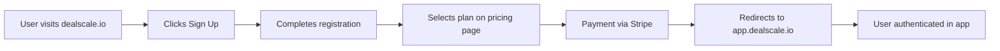
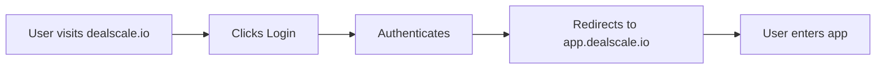
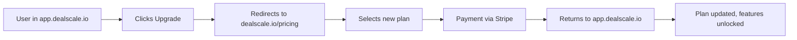
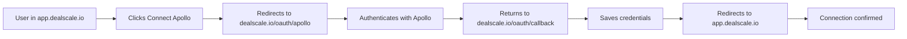

# Domain Architecture & Authentication Flow

## Overview
DealScale uses a multi-domain architecture where authentication, purchases, and billing are handled on the main marketing site, while the application itself runs on a separate domain.

## Domain Structure

### Main Marketing Site
- **Domain**: `dealscale.io`
- **Purpose**: Marketing, authentication, purchases, billing
- **Handles**:
  - User registration & login
  - Pricing page & plan selection
  - Payment processing (Stripe)
  - Subscription management
  - Billing portal
  - OAuth redirects

### Application Domain
- **Domain**: `app.dealscale.io`
- **Purpose**: Core application functionality
- **Handles**:
  - All app features (campaigns, workflows, leads, etc.)
  - User dashboard
  - AI generators
  - Data management
  - API interactions

## Authentication Flow

### New User Registration


### Existing User Login


### Upgrade Flow (In-App)


## URL Patterns

### Marketing Site (dealscale.io)
```
https://dealscale.io/
https://dealscale.io/pricing
https://dealscale.io/pricing?upgrade=starter
https://dealscale.io/pricing?upgrade=pro
https://dealscale.io/pricing?upgrade=enterprise
https://dealscale.io/pricing?feature=ai-agents
https://dealscale.io/login
https://dealscale.io/signup
https://dealscale.io/billing
```

### Application (app.dealscale.io)
```
https://app.dealscale.io/
https://app.dealscale.io/dashboard
https://app.dealscale.io/campaigns
https://app.dealscale.io/workflows
https://app.dealscale.io/leads
https://app.dealscale.io/settings
```

## Query Parameters for Upgrade Links

### Upgrade with Plan Selection
```
https://dealscale.io/pricing?upgrade=starter
https://dealscale.io/pricing?upgrade=pro
https://dealscale.io/pricing?upgrade=enterprise
```

### Upgrade with Feature Context
```
https://dealscale.io/pricing?upgrade=starter&feature=ai-agents
https://dealscale.io/pricing?upgrade=pro&feature=workflows
https://dealscale.io/pricing?upgrade=pro&feature=advanced-search
```

### Return URL (Post-Purchase)
```
https://dealscale.io/pricing?upgrade=pro&return_to=app.dealscale.io/dashboard
```

## Implementation in App

### Upgrade Links
All upgrade links in the app should point to `dealscale.io/pricing` with appropriate query parameters:

```typescript
// Example: AI Agents upgrade link
<a 
  href="https://dealscale.io/pricing?upgrade=starter&feature=ai-agents" 
  target="_blank"
  rel="noopener noreferrer"
>
  Upgrade
</a>
```

### Common Upgrade Triggers

| Feature | Required Plan | Link |
|---------|--------------|------|
| AI Agents (A2A) | Starter+ | `dealscale.io/pricing?upgrade=starter&feature=ai-agents` |
| Advanced Workflows | Pro | `dealscale.io/pricing?upgrade=pro&feature=workflows` |
| Unlimited Leads | Pro | `dealscale.io/pricing?upgrade=pro&feature=unlimited-leads` |
| White Label | Enterprise | `dealscale.io/pricing?upgrade=enterprise&feature=white-label` |

### Feature Guards
When implementing feature guards, use the pattern:

```typescript
{!hasFeatureAccess && (
  <span className="flex items-center gap-1">
    🔒 Feature requires {requiredPlan}.{" "}
    <a 
      href={`https://dealscale.io/pricing?upgrade=${planSlug}&feature=${featureSlug}`}
      target="_blank"
      rel="noopener noreferrer"
      className="font-semibold text-primary underline hover:text-primary/80"
    >
      Upgrade
    </a>
  </span>
)}
```

## Session Management

### Cross-Domain Session Sharing
- Authentication tokens are shared between `dealscale.io` and `app.dealscale.io`
- Cookie domain set to `.dealscale.io` for shared session
- JWT tokens stored in httpOnly cookies
- CSRF protection enabled

### Token Refresh
- Tokens automatically refresh on `app.dealscale.io`
- If refresh fails, redirect to `dealscale.io/login?return_to=app.dealscale.io/[current-path]`

## Billing & Subscription Management

### Managed on Main Site
All subscription and billing operations occur on `dealscale.io`:

1. **Plan Changes**: `dealscale.io/billing?action=change-plan`
2. **Payment Method**: `dealscale.io/billing?action=update-payment`
3. **Invoices**: `dealscale.io/billing?action=view-invoices`
4. **Cancel Subscription**: `dealscale.io/billing?action=cancel`

### Stripe Integration
- Stripe Customer Portal hosted on `dealscale.io/billing`
- Webhook endpoints on `dealscale.io/api/webhooks/stripe`
- After billing actions, user redirected back to `app.dealscale.io`

## OAuth & Third-Party Integrations

### OAuth Flow


### OAuth Redirect URIs
```
https://dealscale.io/oauth/callback/apollo
https://dealscale.io/oauth/callback/salesforce
https://dealscale.io/oauth/callback/hubspot
https://dealscale.io/oauth/callback/google
```

## Environment Variables

### App (app.dealscale.io)
```env
NEXT_PUBLIC_MAIN_SITE_URL=https://dealscale.io
NEXT_PUBLIC_APP_URL=https://app.dealscale.io
NEXT_PUBLIC_API_URL=https://api.dealscale.io
```

### Usage in Code
```typescript
// Upgrade link
const upgradeUrl = `${process.env.NEXT_PUBLIC_MAIN_SITE_URL}/pricing?upgrade=starter`;

// Login redirect
const loginUrl = `${process.env.NEXT_PUBLIC_MAIN_SITE_URL}/login?return_to=${encodeURIComponent(window.location.href)}`;

// Billing portal
const billingUrl = `${process.env.NEXT_PUBLIC_MAIN_SITE_URL}/billing`;
```

## Security Considerations

### CORS Configuration
```javascript
// Allow requests from app subdomain
const allowedOrigins = [
  'https://dealscale.io',
  'https://app.dealscale.io',
  'https://api.dealscale.io',
];
```

### Cookie Settings
```javascript
// Shared cookies across subdomains
{
  domain: '.dealscale.io',
  secure: true,
  httpOnly: true,
  sameSite: 'lax',
}
```

### HTTPS Only
- All domains enforce HTTPS
- HTTP traffic automatically redirects to HTTPS
- HSTS headers enabled

## Testing

### Local Development
```
Marketing: http://localhost:3000 (dealscale.io)
App: http://localhost:3001 (app.dealscale.io)
API: http://localhost:8000 (api.dealscale.io)
```

### Staging
```
Marketing: https://staging.dealscale.io
App: https://app.staging.dealscale.io
API: https://api.staging.dealscale.io
```

### Production
```
Marketing: https://dealscale.io
App: https://app.dealscale.io
API: https://api.dealscale.io
```

## Migration Checklist

When implementing this architecture:

- [ ] Update all upgrade links to use `dealscale.io/pricing`
- [ ] Configure cross-domain session sharing
- [ ] Set up OAuth redirect URIs on `dealscale.io`
- [ ] Configure Stripe webhooks for `dealscale.io`
- [ ] Update CORS settings for cross-origin requests
- [ ] Set cookie domain to `.dealscale.io`
- [ ] Update environment variables
- [ ] Test authentication flow across domains
- [ ] Test upgrade flow end-to-end
- [ ] Verify session persistence
- [ ] Test OAuth integrations

## Benefits of This Architecture

1. **Separation of Concerns**: Marketing and app logic are decoupled
2. **SEO Optimization**: Main site can be optimized for search engines
3. **Performance**: App can be optimized for interactivity without marketing overhead
4. **Security**: Billing and payments isolated from main app
5. **Scalability**: Domains can be scaled independently
6. **Branding**: Clean separation between marketing and product

## Common Patterns

### Feature Gate with Upgrade
```typescript
{!hasAccess && (
  <FeatureGuard
    feature="ai-agents"
    requiredPlan="Starter+"
    upgradeUrl="https://dealscale.io/pricing?upgrade=starter&feature=ai-agents"
    message="AI Agents require Starter+ plan"
  />
)}
```

### Billing Portal Link
```typescript
<a 
  href="https://dealscale.io/billing"
  target="_blank"
  rel="noopener noreferrer"
>
  Manage Subscription
</a>
```

### Logout (Clears Both Domains)
```typescript
const handleLogout = async () => {
  // Clear app session
  await fetch('/api/auth/logout', { method: 'POST' });
  
  // Redirect to main site logout (clears main session)
  window.location.href = 'https://dealscale.io/logout?return_to=https://dealscale.io';
};
```

## Support & Troubleshooting

### Common Issues

**Session Not Persisting Across Domains**
- Check cookie domain is set to `.dealscale.io`
- Verify HTTPS is enabled on both domains
- Check browser is not blocking third-party cookies

**Upgrade Link Not Working**
- Verify URL format: `https://dealscale.io/pricing?upgrade=starter`
- Check query parameters are properly encoded
- Ensure `target="_blank"` is used for new tab

**OAuth Redirect Fails**
- Verify redirect URI matches registered URI exactly
- Check domain in OAuth provider settings
- Ensure callback endpoint exists on `dealscale.io`

## Related Documentation

- Billing & Payments: `_docs/business/_pricing.md`
- Feature Blocking: `_docs/features/featureBlocking/`
- OAuth Integration: `_docs/features/discord-integration/01_oauth2_account_linking.md`
- Security: `_docs/features/security/security-plan.md`


