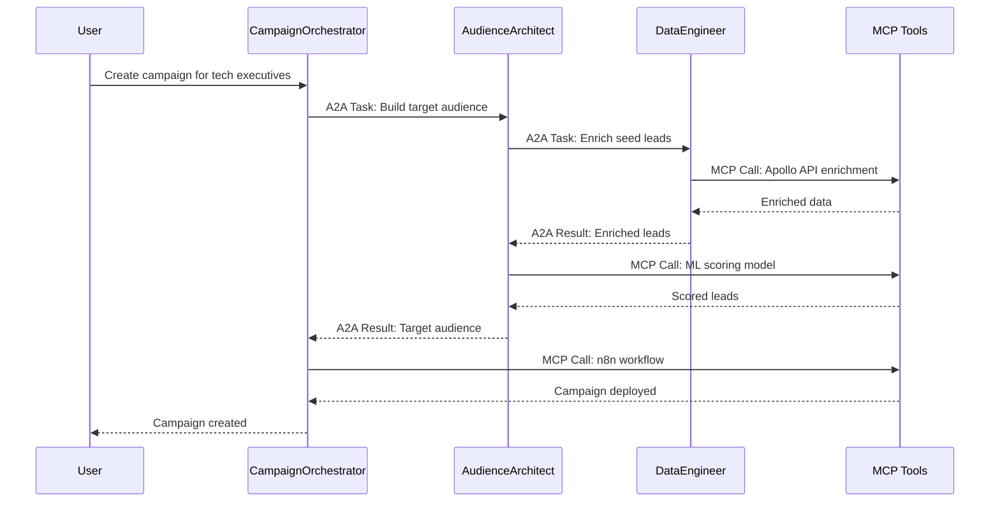

# Agent2Agent (A2A) Protocol Implementation Plan

## Overview
This document outlines the implementation strategy for integrating the Agent2Agent (A2A) Protocol into DealScale's multi-agent intelligence suite, enabling direct agent-to-agent communication and collaboration.

## What is A2A?

**Agent2Agent (A2A) Protocol** is an open standard for enabling agents to discover, communicate, and collaborate with each other. Unlike MCP (Model Context Protocol), which connects agents to tools and data sources, A2A facilitates **direct agent-to-agent task delegation**.

### A2A vs MCP

| Protocol | Purpose | Use Case in DealScale |
|----------|---------|---------------------|
| **A2A** | Agent-to-agent communication | `AudienceArchitect` delegates enrichment to `DataEngineer` |
| **MCP** | Agent-to-tool communication | `DataEngineer` calls Apollo API or database |

**Both protocols are complementary**: MCP connects agents to the outside world, A2A connects agents to each other.

## DealScale Agent Architecture

### Current Agents

```
┌─────────────────────────────────────────────────┐
│           DealScale Agent Ecosystem             │
├─────────────────────────────────────────────────┤
│                                                 │
│  DataEngineer                                   │
│  ├─ Capabilities: enrichLeads, dedupeLeads     │
│  ├─ Tools (via MCP): Apollo, Clearbit, DB      │
│  └─ Endpoint: /agents/data-engineer            │
│                                                 │
│  AudienceArchitect                              │
│  ├─ Capabilities: scoreLookalike, segment      │
│  ├─ Tools (via MCP): ML models, analytics DB   │
│  └─ Endpoint: /agents/audience-architect       │
│                                                 │
│  CampaignOrchestrator                           │
│  ├─ Capabilities: launchCampaign, trackMetrics │
│  ├─ Tools (via MCP): n8n, Make, email APIs     │
│  └─ Endpoint: /agents/campaign-orchestrator    │
│                                                 │
│  WorkflowAutomation                             │
│  ├─ Capabilities: createWorkflow, executeFlow  │
│  ├─ Tools (via MCP): n8n, Make, Kestra APIs    │
│  └─ Endpoint: /agents/workflow-automation      │
│                                                 │
└─────────────────────────────────────────────────┘
```

### Agent Communication Flow



## Best Practices for Production A2A

### ✅ 1. Define Clear Agent Roles & Capabilities

**Agent Card** (JSON metadata) for each agent:

```json
{
  "agentId": "DataEngineer",
  "version": "2.1.0",
  "name": "DealScale Data Engineer",
  "description": "Lead enrichment, deduplication, and data quality",
  "endpoint": "https://agents.dealscale.io/data-engineer",
  "capabilities": [
    {
      "id": "enrichLeads",
      "description": "Enrich leads with Apollo, Clearbit, or ZoomInfo",
      "inputs": {
        "leadIds": "array<string>",
        "provider": "apollo | clearbit | zoominfo",
        "fields": "array<string>"
      },
      "outputs": {
        "enrichedLeads": "array<Lead>",
        "creditsUsed": "number"
      },
      "estimatedDuration": "30-120s",
      "creditsPerLead": 2
    },
    {
      "id": "dedupeLeads",
      "description": "Remove duplicate leads based on email/company",
      "inputs": {
        "leadIds": "array<string>",
        "strategy": "email | company | phone"
      },
      "outputs": {
        "uniqueLeads": "array<Lead>",
        "duplicatesRemoved": "number"
      },
      "estimatedDuration": "5-15s",
      "creditsPerLead": 0.1
    }
  ],
  "authentication": {
    "type": "bearer",
    "headerName": "Authorization",
    "required": true
  },
  "rateLimit": {
    "requestsPerMinute": 60,
    "burstSize": 100
  },
  "tenantAware": true,
  "regions": ["us-east", "eu-west"],
  "status": "active"
}
```

**Key Principles:**
- ✅ **No overlapping responsibilities**: Each agent has distinct domain
- ✅ **Runtime discovery**: Clients query agent registry for capabilities
- ✅ **Versioned capabilities**: Support backward compatibility
- ✅ **Clear input/output contracts**: Type-safe communication

### ✅ 2. Secure Communication & Authentication

**Security Requirements:**

```typescript
// Authentication middleware
interface AgentAuthContext {
  agentId: string;
  tenantId: string;
  userId?: string;
  scopes: string[];
  token: string;
  expiresAt: Date;
}

// Validate every A2A request
async function validateA2ARequest(req: Request): Promise<AgentAuthContext> {
  // 1. Verify JWT token
  const token = extractBearerToken(req);
  const decoded = await verifyJWT(token, process.env.A2A_JWT_SECRET);
  
  // 2. Check agent exists and is active
  const callingAgent = await agentRegistry.getAgent(decoded.agentId);
  if (callingAgent.status !== 'active') {
    throw new Error('Agent is not active');
  }
  
  // 3. Validate tenant access
  if (decoded.tenantId !== req.body.task.tenantId) {
    throw new Error('Tenant mismatch');
  }
  
  // 4. Check rate limits
  await checkRateLimit(decoded.agentId, decoded.tenantId);
  
  // 5. Audit log
  await auditLog.record({
    event: 'a2a_request',
    callingAgent: decoded.agentId,
    targetAgent: req.params.agentId,
    taskType: req.body.task.type,
    tenantId: decoded.tenantId,
    timestamp: new Date(),
  });
  
  return decoded;
}
```

**Security Checklist:**
- [x] HTTPS with TLS 1.3+
- [x] Bearer tokens (JWT) for authentication
- [x] Mutual TLS for sensitive agents
- [x] Input validation (treat all agent input as untrusted)
- [x] Audit trails for all A2A calls
- [x] Rate limiting per agent per tenant
- [x] Tenant data isolation
- [x] Encryption at rest and in transit

### ✅ 3. Task Lifecycle & Streaming

**Task States:**

```typescript
enum TaskStatus {
  SUBMITTED = 'submitted',   // Task received, queued
  WORKING = 'working',       // Agent is processing
  COMPLETED = 'completed',   // Success
  FAILED = 'failed',         // Error occurred
  CANCELLED = 'cancelled',   // User/agent cancelled
  TIMEOUT = 'timeout',       // Exceeded deadline
}

interface A2ATask {
  taskId: string;
  type: string;
  status: TaskStatus;
  inputs: Record<string, any>;
  outputs?: Record<string, any>;
  error?: { code: string; message: string; details?: any };
  requesterAgentId: string;
  targetAgentId: string;
  tenantId: string;
  userId?: string;
  sessionId?: string;
  createdAt: Date;
  updatedAt: Date;
  completedAt?: Date;
  deadline?: Date;
  estimatedDuration?: number;
  actualDuration?: number;
  creditsUsed?: number;
  metadata?: Record<string, any>;
}
```

**Streaming Updates (SSE):**

```typescript
// Long-running tasks use Server-Sent Events
app.get('/agents/:agentId/tasks/:taskId/stream', async (req, res) => {
  res.setHeader('Content-Type', 'text/event-stream');
  res.setHeader('Cache-Control', 'no-cache');
  res.setHeader('Connection', 'keep-alive');
  
  const taskId = req.params.taskId;
  
  // Stream progress updates
  const unsubscribe = taskEventBus.subscribe(taskId, (event) => {
    res.write(`data: ${JSON.stringify(event)}\n\n`);
    
    if (event.status === 'completed' || event.status === 'failed') {
      unsubscribe();
      res.end();
    }
  });
  
  req.on('close', unsubscribe);
});
```

**Example Progress Events:**
```json
{"status": "submitted", "progress": 0, "message": "Task queued"}
{"status": "working", "progress": 0.3, "message": "Enriching 150/500 leads"}
{"status": "working", "progress": 0.7, "message": "Scoring leads with ML model"}
{"status": "completed", "progress": 1.0, "result": {...}}
```

### ✅ 4. Tenant Context & Multi-Tenancy

**Every A2A task must include tenant context:**

```typescript
interface TenantContext {
  tenantId: string;          // Required
  userId?: string;           // Optional (for user-specific tasks)
  sessionId?: string;        // Optional (for conversation context)
  workspaceId?: string;      // Optional (for workspace isolation)
  organizationId?: string;   // Optional (for org-level tasks)
}

// Enforce row-level security
async function getLeadsForTask(task: A2ATask): Promise<Lead[]> {
  return db.leads.findMany({
    where: {
      tenantId: task.tenantId,  // Tenant isolation
      id: { in: task.inputs.leadIds },
    },
  });
}

// Track credit usage per tenant
async function deductCredits(task: A2ATask, creditsUsed: number) {
  await db.tenantCredits.update({
    where: { tenantId: task.tenantId },
    data: {
      creditsRemaining: { decrement: creditsUsed },
      creditsUsed: { increment: creditsUsed },
    },
  });
  
  await db.creditUsageLog.create({
    data: {
      tenantId: task.tenantId,
      agentId: task.targetAgentId,
      taskId: task.taskId,
      creditsUsed,
      operation: task.type,
      timestamp: new Date(),
    },
  });
}
```

### ✅ 5. Failure Handling & Fallbacks

```typescript
// Retry logic with exponential backoff
async function callAgentWithRetry(
  task: A2ATask,
  maxRetries = 3
): Promise<A2ATaskResult> {
  let attempt = 0;
  let lastError: Error;
  
  while (attempt < maxRetries) {
    try {
      return await callAgent(task);
    } catch (error) {
      lastError = error;
      attempt++;
      
      // Exponential backoff: 1s, 2s, 4s
      const delayMs = Math.pow(2, attempt) * 1000;
      await sleep(delayMs);
      
      // Log retry
      await auditLog.record({
        event: 'a2a_retry',
        taskId: task.taskId,
        attempt,
        error: error.message,
      });
    }
  }
  
  // All retries failed - try fallback agent
  if (task.fallbackAgentId) {
    console.warn(`Primary agent failed, trying fallback: ${task.fallbackAgentId}`);
    task.targetAgentId = task.fallbackAgentId;
    return await callAgent(task);
  }
  
  throw lastError;
}

// Circuit breaker pattern
class AgentCircuitBreaker {
  private failureCount = 0;
  private lastFailureTime?: Date;
  private state: 'closed' | 'open' | 'half-open' = 'closed';
  
  async execute<T>(fn: () => Promise<T>): Promise<T> {
    if (this.state === 'open') {
      // Check if we should try again (after cooldown)
      if (Date.now() - this.lastFailureTime.getTime() > 60000) {
        this.state = 'half-open';
      } else {
        throw new Error('Circuit breaker is open - agent unavailable');
      }
    }
    
    try {
      const result = await fn();
      this.onSuccess();
      return result;
    } catch (error) {
      this.onFailure();
      throw error;
    }
  }
  
  private onSuccess() {
    this.failureCount = 0;
    this.state = 'closed';
  }
  
  private onFailure() {
    this.failureCount++;
    this.lastFailureTime = new Date();
    
    if (this.failureCount >= 5) {
      this.state = 'open';
    }
  }
}
```

### ✅ 6. Scalability & Reuse

**Agent Registry:**

```typescript
class AgentRegistry {
  private agents = new Map<string, AgentCard>();
  
  async registerAgent(card: AgentCard) {
    // Validate agent card
    this.validateAgentCard(card);
    
    // Store in registry
    this.agents.set(card.agentId, card);
    
    // Publish to discovery service
    await this.discoveryService.publish(card);
    
    console.log(`✅ Registered agent: ${card.agentId} v${card.version}`);
  }
  
  async discoverCapability(capabilityName: string): Promise<AgentCard[]> {
    const matches: AgentCard[] = [];
    
    for (const [_, card] of this.agents) {
      if (card.status !== 'active') continue;
      
      for (const cap of card.capabilities) {
        if (cap.id === capabilityName || cap.tags?.includes(capabilityName)) {
          matches.push(card);
          break;
        }
      }
    }
    
    return matches;
  }
  
  async getAgent(agentId: string, version?: string): Promise<AgentCard> {
    const agent = this.agents.get(agentId);
    if (!agent) throw new Error(`Agent not found: ${agentId}`);
    if (version && agent.version !== version) {
      throw new Error(`Agent version mismatch: expected ${version}, got ${agent.version}`);
    }
    return agent;
  }
}
```

**Reusable Agent Patterns:**

```typescript
// AudienceArchitect can be reused across workflows
const audienceArchitect = await agentRegistry.getAgent('AudienceArchitect');

// Workflow 1: Q1 Campaign
const q1Audience = await callAgent({
  targetAgentId: 'AudienceArchitect',
  type: 'scoreLookalike',
  inputs: { seedList: 'q1-tech-execs', tenantId: 'acme' },
});

// Workflow 2: Retargeting
const retargetAudience = await callAgent({
  targetAgentId: 'AudienceArchitect',
  type: 'filterProspects',
  inputs: { filters: { engaged: true }, tenantId: 'acme' },
});
```

### ✅ 7. Observability & Analytics

**Metrics to Track:**

```typescript
interface AgentMetrics {
  agentId: string;
  period: { start: Date; end: Date };
  tasksSubmitted: number;
  tasksCompleted: number;
  tasksFailed: number;
  tasksCancelled: number;
  avgDuration: number;
  p50Duration: number;
  p95Duration: number;
  p99Duration: number;
  totalCreditsUsed: number;
  errorRate: number;
  timeoutRate: number;
  avgLatency: number;
  throughput: number;  // tasks/minute
}

// Prometheus metrics
const metrics = {
  taskDuration: new Histogram({
    name: 'a2a_task_duration_seconds',
    help: 'A2A task duration',
    labelNames: ['agent_id', 'task_type', 'status', 'tenant_id'],
  }),
  taskCounter: new Counter({
    name: 'a2a_tasks_total',
    help: 'Total A2A tasks',
    labelNames: ['agent_id', 'task_type', 'status', 'tenant_id'],
  }),
  creditsUsed: new Counter({
    name: 'a2a_credits_used_total',
    help: 'Total credits used',
    labelNames: ['agent_id', 'tenant_id'],
  }),
};

// Record metrics
metrics.taskDuration.observe(
  { agent_id: 'DataEngineer', task_type: 'enrichLeads', status: 'completed', tenant_id: 'acme' },
  task.actualDuration
);
```

**User Dashboard:**

```typescript
// Show agent performance to users
interface AgentDashboard {
  agent: string;
  tasksCompleted: number;
  avgTime: string;
  creditsUsed: number;
  successRate: number;
  lastRun: Date;
  recentTasks: Array<{
    id: string;
    type: string;
    status: TaskStatus;
    duration: number;
    createdAt: Date;
  }>;
}
```

### ✅ 8. Interoperability & No Lock-In

**A2A + MCP Coexistence:**

```typescript
// Agent uses BOTH protocols
class DataEngineerAgent {
  // A2A: Receive tasks from other agents
  async handleA2ATask(task: A2ATask): Promise<A2ATaskResult> {
    if (task.type === 'enrichLeads') {
      // MCP: Call external tools
      const apolloData = await this.mcpClient.call('apollo', 'bulkEnrich', {
        leads: task.inputs.leadIds,
      });
      
      const clearedData = await this.mcpClient.call('clearbit', 'companyLookup', {
        companies: apolloData.companies,
      });
      
      return {
        taskId: task.taskId,
        status: 'completed',
        outputs: {
          enrichedLeads: this.mergeData(apolloData, clearedData),
          creditsUsed: task.inputs.leadIds.length * 2,
        },
      };
    }
  }
  
  // A2A: Call other agents
  async delegateTask(targetAgent: string, taskType: string, inputs: any) {
    return await this.a2aClient.createTask({
      targetAgentId: targetAgent,
      type: taskType,
      inputs,
      tenantId: this.tenantId,
    });
  }
}
```

### ✅ 9. Version Management

```typescript
// Agent versioning strategy
interface AgentVersion {
  version: string;           // "2.1.0"
  deprecated?: boolean;
  deprecationDate?: Date;
  replacedBy?: string;       // "2.2.0"
  breaking changes?: string[];
  migrationGuide?: string;
}

// Clients specify version requirements
const task: A2ATask = {
  targetAgentId: 'DataEngineer',
  targetVersion: '2.x',      // Semver range
  type: 'enrichLeads',
  // ...
};

// Registry routes to compatible version
const agent = await registry.getCompatibleAgent('DataEngineer', '2.x');
```

### ✅ 10. Governance, Privacy & Compliance

```typescript
// GDPR/CCPA compliance
interface DataGovernance {
  dataClassification: 'public' | 'internal' | 'confidential' | 'restricted';
  piiFields: string[];
  retentionPeriod: number;  // days
  encryptionRequired: boolean;
  auditRequired: boolean;
}

// Encrypt sensitive data in tasks
async function encryptTaskInputs(task: A2ATask): Promise<A2ATask> {
  if (task.metadata?.dataClassification === 'confidential') {
    task.inputs = await encrypt(task.inputs, tenantEncryptionKey);
  }
  return task;
}

// Audit log for compliance
interface ComplianceAuditLog {
  timestamp: Date;
  tenantId: string;
  userId?: string;
  agentId: string;
  action: 'task_created' | 'data_accessed' | 'data_modified' | 'data_exported';
  dataClassification: string;
  piiAccessed: string[];
  justification: string;
  ipAddress: string;
  userAgent: string;
}
```

## Implementation Checklist

### Phase 1: Foundation (Week 1-2)
- [ ] Define agent cards for all agents
- [ ] Implement agent registry
- [ ] Set up authentication (JWT tokens)
- [ ] Create task data models
- [ ] Implement basic A2A client/server

### Phase 2: Core Features (Week 3-4)
- [ ] Task lifecycle management
- [ ] Streaming updates (SSE)
- [ ] Retry logic & circuit breakers
- [ ] Tenant context propagation
- [ ] Credit tracking per task

### Phase 3: Observability (Week 5)
- [ ] Prometheus metrics
- [ ] Audit logging
- [ ] User dashboard
- [ ] Error tracking (Sentry)
- [ ] Performance monitoring

### Phase 4: Security & Compliance (Week 6)
- [ ] Input validation
- [ ] Rate limiting
- [ ] Data encryption
- [ ] GDPR compliance
- [ ] Security audit

### Phase 5: Testing & QA (Week 7)
- [ ] Unit tests for each agent
- [ ] Integration tests for A2A flows
- [ ] Load testing
- [ ] Failure scenario testing
- [ ] Multi-tenant isolation testing

### Phase 6: Production Rollout (Week 8)
- [ ] Staging environment deployment
- [ ] Beta testing with select tenants
- [ ] Monitoring & alerting setup
- [ ] Documentation
- [ ] Production deployment

## Next Steps

1. **Review Agent Cards**: Define capabilities for each agent
2. **Set up Agent Registry**: Centralized discovery service
3. **Implement Authentication**: JWT tokens for agent-to-agent auth
4. **Create Task Queue**: For async task processing
5. **Add Observability**: Metrics, logs, traces

## References

- [A2A Protocol Specification](https://a2aprotocol.ai)
- [Google A2A Announcement](https://developers.googleblog.com/en/a2a-a-new-era-of-agent-interoperability/)
- [A2A vs MCP Comparison](https://www.stride.build/blog/agent-to-agent-a2a-vs-model-context-protocol-mcp-when-to-use-which)
- [MCP Integration Guide](../../integration/ai-agents/mcp-provider-integration.md)


