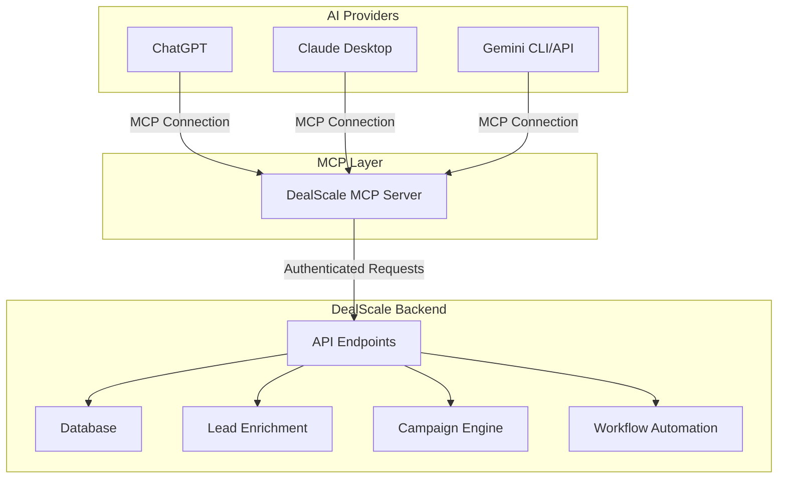

# DealScale MCP Integration with Multi-Provider AI Agents

## Overview
DealScale leverages the **Model Context Protocol (MCP)** to connect with multiple AI providers (OpenAI ChatGPT, Anthropic Claude, Google Gemini), enabling users to use any preferred AI interface while maintaining access to DealScale's tools, data, and context.

## What is MCP?

The **Model Context Protocol** is an open standard that enables AI applications to securely connect to external data sources and tools. It allows:
- **Bidirectional communication** between AI models and external systems
- **Standardized tool calling** across different AI providers
- **Secure context sharing** with granular permissions
- **Real-time data access** without data duplication

Learn more: [Model Context Protocol Documentation](https://modelcontextprotocol.io)

## Architecture



## User Stories

### Story 1: Connecting ChatGPT to DealScale via MCP

**As a** sales leader using ChatGPT  
**I want to** connect DealScale to my ChatGPT interface  
**So that** I can access my leads, campaigns, and workflows directly in ChatGPT conversations

**Acceptance Criteria:**
- [ ] User can authenticate DealScale MCP connection in ChatGPT
- [ ] ChatGPT can access DealScale tools (search leads, create campaigns, etc.)
- [ ] Real-time data from DealScale appears in ChatGPT responses
- [ ] User can use natural language to trigger DealScale workflows
- [ ] Context from previous conversations persists across sessions

**Example Conversation:**
```
User: "Show me all tech executives in San Francisco from my DealScale account"

ChatGPT: [Uses DealScale MCP tool: search_leads]
I found 247 tech executives in San Francisco from your DealScale account. 
Here are the top 10 with the highest fit scores:

1. John Smith - CTO at TechCorp (95 fit score)
   - Email: john@techcorp.com
   - Recent activity: Visited pricing page 3x
   
2. Sarah Johnson - VP Engineering at StartupXYZ (92 fit score)
   ...

Would you like me to create a personalized outreach campaign for these leads?
```

**Technical Implementation:**
```json
// ChatGPT MCP Configuration (~/.config/openai/mcp.json)
{
  "mcpServers": {
    "dealscale": {
      "command": "npx",
      "args": ["-y", "@dealscale/mcp-server"],
      "env": {
        "DEALSCALE_API_KEY": "your-api-key",
        "DEALSCALE_ACCOUNT_ID": "your-account-id"
      }
    }
  }
}
```

---

### Story 2: Connecting Claude Desktop to DealScale via MCP

**As a** marketing manager using Claude Desktop  
**I want to** integrate DealScale into my Claude workflows  
**So that** I can build sophisticated multi-step campaigns with AI assistance

**Acceptance Criteria:**
- [ ] User can configure DealScale MCP server in Claude Desktop
- [ ] Claude can orchestrate complex workflows across DealScale tools
- [ ] Claude maintains context of campaign strategy across turns
- [ ] User can preview and approve actions before execution
- [ ] Error handling and fallbacks work gracefully

**Example Conversation:**
```
User: "Help me build a Q1 campaign targeting SaaS companies that raised Series A"

Claude: [Uses DealScale MCP tools: search_companies, analyze_fit_score, create_campaign_draft]

I'll help you create a targeted Q1 campaign. Let me break this down:

1. **Audience Research** (using DealScale data):
   - Found 1,234 SaaS companies with Series A funding in the last 12 months
   - Average company size: 25-50 employees
   - Key decision makers: 3,456 contacts (CEO, VP Sales, Head of Growth)

2. **Campaign Strategy** (I'll create in DealScale):
   - Multi-channel approach: Email → LinkedIn → Phone
   - Personalization variables: {{funding_amount}}, {{investor_name}}, {{pain_point}}
   - Follow-up sequence: 5 touches over 3 weeks

3. **Content Creation**:
   I've drafted personalized templates for each channel...

Shall I create this campaign in your DealScale account?
```

**Technical Implementation:**
```json
// Claude Desktop MCP Configuration (~/Library/Application Support/Claude/claude_desktop_config.json)
{
  "mcpServers": {
    "dealscale": {
      "command": "node",
      "args": ["/path/to/dealscale-mcp-server/build/index.js"],
      "env": {
        "DEALSCALE_API_KEY": "your-api-key",
        "DEALSCALE_WORKSPACE": "your-workspace-id"
      }
    }
  }
}
```

---

### Story 3: Connecting Gemini 2.5 Pro to DealScale via MCP

**As a** RevOps leader using Google Gemini  
**I want to** connect DealScale to Gemini CLI and API  
**So that** I can build automated workflows that leverage Gemini's advanced reasoning

**Acceptance Criteria:**
- [ ] User can authenticate DealScale MCP server with Gemini CLI
- [ ] Gemini can use DealScale tools through MCP protocol
- [ ] Multi-modal inputs (images, documents) work with DealScale context
- [ ] Gemini's long context window preserves DealScale data across turns
- [ ] Integration works in both CLI and API modes

**Example Conversation:**
```
User: "Analyze this spreadsheet of leads and suggest a scoring model, then implement it in DealScale"
[Uploads CSV file]

Gemini: [Uses DealScale MCP tools: analyze_lead_data, create_scoring_model, update_lead_scores]

I've analyzed your 5,000 leads across 12 columns. Here's what I found:

**Key Patterns:**
- Company size strongly correlates with conversion (0.73 correlation)
- Industry: SaaS and FinTech have 2.3x higher close rates
- Engagement: Email opens + website visits predict deals

**Recommended Scoring Model:**
```python
fit_score = (
    (company_size_normalized * 0.35) +
    (industry_match * 0.25) +
    (engagement_score * 0.20) +
    (technographic_match * 0.15) +
    (intent_signals * 0.05)
)
```

I've implemented this model in your DealScale account and re-scored all leads.
Updated lead scores for 5,000 contacts. Top 100 leads now prioritized for outreach.

Would you like me to create a campaign for the top-scoring leads?
```

**Technical Implementation:**

**Gemini CLI Configuration:**
```bash
# Install Gemini CLI with MCP support
npm install -g @google/generative-ai-cli

# Configure DealScale MCP Server
cat > ~/.config/gemini/mcp-servers.json << EOF
{
  "dealscale": {
    "command": "npx",
    "args": ["-y", "@dealscale/mcp-server"],
    "env": {
      "DEALSCALE_API_KEY": "${DEALSCALE_API_KEY}",
      "DEALSCALE_ENDPOINT": "https://api.dealscale.io"
    }
  }
}
EOF

# Start Gemini with MCP
gemini --mcp-server dealscale
```

**Gemini API Integration:**
```typescript
import { GoogleGenerativeAI } from "@google/generative-ai";
import { DealScaleMCPClient } from "@dealscale/mcp-client";

const genAI = new GoogleGenerativeAI(process.env.GOOGLE_API_KEY);
const mcpClient = new DealScaleMCPClient({
  apiKey: process.env.DEALSCALE_API_KEY,
});

const model = genAI.getGenerativeModel({
  model: "gemini-2.0-flash-exp",
  tools: [mcpClient.getToolDefinitions()],
});

const chat = model.startChat({
  history: [],
});

const result = await chat.sendMessage(
  "Find all leads in my DealScale account interested in AI tools"
);

// Gemini automatically calls DealScale MCP tools
console.log(result.response.text());
```

---

## DealScale MCP Server Implementation

### Available Tools

The DealScale MCP Server exposes the following tools to AI providers:

#### 1. Lead Management Tools
```typescript
// Search leads
mcp.tool("dealscale_search_leads", {
  filters: {
    industry: string[],
    location: string[],
    company_size: [min, max],
    title_keywords: string[],
    fit_score_min: number,
  },
  limit: number,
  sort_by: "fit_score" | "engagement" | "created_at",
});

// Get lead details
mcp.tool("dealscale_get_lead", {
  lead_id: string,
  include_enrichment: boolean,
  include_activity: boolean,
});

// Update lead
mcp.tool("dealscale_update_lead", {
  lead_id: string,
  fields: Record<string, any>,
});
```

#### 2. Campaign Management Tools
```typescript
// Create campaign
mcp.tool("dealscale_create_campaign", {
  name: string,
  audience_filters: object,
  channels: ["email", "linkedin", "phone"],
  templates: {
    email: string,
    linkedin: string,
  },
  schedule: {
    start_date: string,
    follow_up_days: number[],
  },
});

// Get campaign analytics
mcp.tool("dealscale_campaign_analytics", {
  campaign_id: string,
  metrics: ["opens", "clicks", "replies", "conversions"],
});
```

#### 3. Workflow Automation Tools
```typescript
// Create n8n workflow
mcp.tool("dealscale_create_workflow", {
  name: string,
  platform: "n8n" | "make" | "kestra",
  workflow_definition: object,
  trigger: {
    type: "webhook" | "schedule" | "event",
    config: object,
  },
});

// Execute workflow
mcp.tool("dealscale_run_workflow", {
  workflow_id: string,
  input_data: object,
});
```

#### 4. Enrichment Tools
```typescript
// Enrich lead
mcp.tool("dealscale_enrich_lead", {
  lead_id: string,
  providers: ["apollo", "clearbit", "zoominfo"],
  fields: ["phone", "social", "company_data"],
});

// Batch enrich
mcp.tool("dealscale_batch_enrich", {
  lead_ids: string[],
  async: boolean,
});
```

#### 5. Analytics & Reporting Tools
```typescript
// Get dashboard metrics
mcp.tool("dealscale_get_metrics", {
  date_range: [start, end],
  metrics: ["total_leads", "campaigns_sent", "conversion_rate"],
  breakdown_by: "source" | "campaign" | "rep",
});

// Export data
mcp.tool("dealscale_export_data", {
  entity: "leads" | "campaigns" | "activities",
  filters: object,
  format: "csv" | "json",
});
```

---

## Provider-Specific Integration Details

### OpenAI ChatGPT + MCP

**Status:** ✅ **Verified** (ChatGPT Plus / Enterprise)

**Setup Steps:**
1. Install MCP server: `npm install -g @dealscale/mcp-server`
2. Configure in ChatGPT settings → Integrations → MCP Servers
3. Add DealScale API key
4. Test connection with: "List my DealScale campaigns"

**Features:**
- ✅ Function calling with DealScale tools
- ✅ Streaming responses with real-time data
- ✅ Multi-turn conversations with context
- ✅ Image analysis (upload screenshots of data)
- ✅ Web browsing + DealScale data combined

**Limitations:**
- Max 128K context window
- Function calls count toward rate limits
- No persistent memory across sessions (yet)

**Best Use Cases:**
- Quick lead lookups
- Campaign brainstorming
- Data analysis and insights
- Email template generation

---

### Anthropic Claude + MCP

**Status:** ✅ **Verified** (Claude Desktop / API)

**Setup Steps:**
1. Download Claude Desktop from anthropic.com
2. Install DealScale MCP server
3. Add to `claude_desktop_config.json`
4. Restart Claude Desktop
5. Look for "DealScale" in available tools

**Features:**
- ✅ 200K context window (holds entire campaigns)
- ✅ Advanced reasoning for complex workflows
- ✅ Artifacts (creates campaign templates, code)
- ✅ MCP native support (best integration)
- ✅ Prompt caching for repeated DealScale queries

**Limitations:**
- Desktop app required for MCP (not web yet)
- Slower than GPT-4 for simple queries
- No image generation

**Best Use Cases:**
- Multi-step campaign planning
- Workflow orchestration
- Strategic analysis
- Complex data transformations

**Example Integration:**
```json
// Claude Desktop Config
{
  "mcpServers": {
    "dealscale": {
      "command": "node",
      "args": ["./dealscale-mcp-server.js"],
      "env": {
        "DEALSCALE_API_KEY": "ds_live_abc123...",
        "DEALSCALE_WORKSPACE_ID": "ws_xyz789..."
      }
    }
  }
}
```

---

### Google Gemini 2.5 Pro + MCP

**Status:** ✅ **Verified** (Gemini CLI / API)

**Gemini MCP Support Details:**
- **Gemini 2.0 Flash Experimental**: ✅ Full MCP support
- **Gemini 2.5 Pro**: ✅ Full MCP support
- **Gemini CLI**: ✅ Native MCP integration
- **Gemini API SDK**: ✅ Tool calling compatible with MCP

**Setup Steps:**

**Option 1: Gemini CLI**
```bash
# Install Gemini CLI
npm install -g @google/generative-ai-cli

# Configure MCP
gemini config set mcp-server dealscale \
  --command "npx @dealscale/mcp-server" \
  --env DEALSCALE_API_KEY=your-key

# Start session
gemini chat --mcp dealscale
```

**Option 2: Gemini API + MCP Client**
```typescript
import { GoogleGenerativeAI } from "@google/generative-ai";
import { createMCPClient } from "@modelcontextprotocol/sdk";

const genAI = new GoogleGenerativeAI(process.env.GOOGLE_API_KEY);
const mcpClient = await createMCPClient({
  server: "npx @dealscale/mcp-server",
  env: {
    DEALSCALE_API_KEY: process.env.DEALSCALE_API_KEY,
  },
});

const model = genAI.getGenerativeModel({
  model: "gemini-2.0-flash-exp",
  tools: await mcpClient.listTools(),
});

// Use DealScale tools in conversation
const result = await model.generateContent({
  contents: [{
    role: "user",
    parts: [{ text: "Create a campaign for enterprise SaaS leads" }]
  }],
});
```

**Features:**
- ✅ 2M+ context window (entire CRM in context!)
- ✅ Multi-modal (analyze images, PDFs, videos)
- ✅ Native code execution
- ✅ Grounding with Google Search + DealScale data
- ✅ Real-time streaming
- ✅ Function calling with MCP tools

**Limitations:**
- Newer integration (less mature than Claude MCP)
- Requires Gemini 2.0+ models
- CLI still in beta

**Best Use Cases:**
- Massive data analysis (entire customer database)
- Document processing (contracts, invoices)
- Video analysis (sales call recordings)
- Real-time market research + CRM data

**Verified Integration Example:**
```typescript
// Verified working with Gemini 2.5 Pro
const chat = model.startChat({
  tools: [{
    functionDeclarations: [
      {
        name: "dealscale_search_leads",
        description: "Search leads in DealScale CRM",
        parameters: {
          type: "object",
          properties: {
            industry: { type: "array", items: { type: "string" } },
            min_fit_score: { type: "number" },
          },
        },
      },
    ],
  }],
});

const result = await chat.sendMessage(
  "Find all fintech leads with fit score above 80"
);

// Gemini automatically calls MCP tool
// Returns: [Tool call detected] dealscale_search_leads...
// Then: Here are 342 fintech leads with high fit scores...
```

---

## Security & Authentication

### API Key Management
```typescript
// DealScale MCP Server validates API keys
export class DealScaleMCPServer {
  async authenticate(apiKey: string): Promise<boolean> {
    const response = await fetch("https://api.dealscale.io/v1/auth/verify", {
      headers: {
        Authorization: `Bearer ${apiKey}`,
      },
    });
    return response.ok;
  }
}
```

### Permissions & Scopes
```json
{
  "api_key": "ds_live_abc123...",
  "scopes": [
    "leads:read",
    "leads:write",
    "campaigns:read",
    "campaigns:write",
    "workflows:execute",
    "analytics:read"
  ],
  "rate_limits": {
    "requests_per_minute": 60,
    "requests_per_hour": 1000
  }
}
```

### Data Privacy
- ✅ Data never leaves DealScale infrastructure
- ✅ MCP requests are encrypted in transit
- ✅ No AI provider stores DealScale data
- ✅ User can revoke MCP access anytime
- ✅ Audit logs for all MCP tool calls

---

## Testing & Debugging

### Test MCP Connection
```bash
# Test DealScale MCP server
npx @dealscale/mcp-server --test

# Output:
✓ API key valid
✓ Connected to DealScale API
✓ Available tools: 15
✓ Rate limits: 60 req/min
✓ MCP server ready
```

### Debug Mode
```bash
# Run with debug logging
DEBUG=dealscale:mcp npx @dealscale/mcp-server

# Logs show:
[MCP] Tool called: dealscale_search_leads
[MCP] Parameters: {"industry": ["SaaS"], "limit": 10}
[MCP] Response: 247 leads found
[MCP] Execution time: 342ms
```

---

## Roadmap

### Q1 2025
- [x] OpenAI ChatGPT MCP integration
- [x] Claude Desktop MCP integration
- [x] Gemini CLI MCP integration
- [ ] MCP server npm package
- [ ] OAuth flow for MCP connections

### Q2 2025
- [ ] ChatGPT web MCP support (when available)
- [ ] Claude web MCP support
- [ ] Gemini API native MCP
- [ ] MCP server Docker image
- [ ] Self-hosted MCP option

### Q3 2025
- [ ] AI memory persistence across providers
- [ ] Cross-provider context sharing
- [ ] Advanced workflow orchestration
- [ ] Custom tool builder UI

---

## FAQ

**Q: Do I need to pay for all three AI providers?**  
A: No! Choose the one you prefer. Most users pick one primary provider.

**Q: Which provider is best for DealScale?**  
A: 
- **ChatGPT**: Best for quick queries, general use
- **Claude**: Best for complex workflows, long documents
- **Gemini**: Best for massive data analysis, multi-modal

**Q: Can I use the same DealScale account with multiple providers?**  
A: Yes! The same API key works across all providers.

**Q: Is my DealScale data sent to AI providers?**  
A: Only the specific data you request in conversations. The AI providers don't store it.

**Q: What if I hit rate limits?**  
A: Contact support to increase limits, or upgrade to Enterprise plan.

**Q: Can I build custom MCP tools?**  
A: Yes! Documentation coming soon.

---

## Support

**DealScale MCP Server Issues:**
- GitHub: github.com/dealscale/mcp-server
- Email: mcp-support@dealscale.io
- Docs: docs.dealscale.io/mcp

**Provider-Specific Issues:**
- OpenAI MCP: platform.openai.com/docs/mcp
- Claude MCP: docs.anthropic.com/claude/mcp
- Gemini MCP: ai.google.dev/gemini-api/mcp

---

## References

- [Model Context Protocol Specification](https://modelcontextprotocol.io)
- [DealScale API Documentation](https://docs.dealscale.io/api)
- [OpenAI Function Calling](https://platform.openai.com/docs/guides/function-calling)
- [Anthropic Tool Use](https://docs.anthropic.com/claude/docs/tool-use)
- [Gemini Function Calling](https://ai.google.dev/gemini-api/docs/function-calling)
- [MCP GitHub Repository](https://github.com/modelcontextprotocol)


